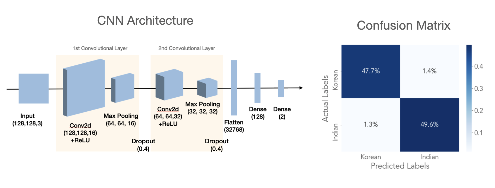

# Is it Korean? or Indian? 
## Cuisine recognition from images using Neural Network

Food identification from images is of great interest to the machine learning community - with proper image recognition, this can be useful in understanding food composition, nutritional information, or understanding a person's dietary habits. Previously, high performance models have been established for identifying a single food item (i.e. type of fruits/vegetables/individual dishes). The goal of this project, however, is to use neural networks to identify the overall cuisine from images of individual dishes.  

Cuisine identification can be helpful for:  
1. A user who sees a photo of a dish and wants to identify which cuisine it is  
2. Building auto tag generation for search engines or restaurant review apps for their data analysis.  

Additionally, the pipeline for this cuisine recognizer can be extended to other object identifications. 

## The data
### Data source
- The data was downloaded from the web using a python package `bing_image_downloader` ([link](https://github.com/gurugaurav/bing_image_downloader))
- Total of 10k images (~5000 Korean, ~5000 Indian) were split into training (80%) and test (20%) sets. 

Examples of indian cuisine images and korean cuisine images are shown below [Fig 1]. As oppose to classifying two specific dishes that are visually very different, classifying cuisine is challenging due to the diversity of dishes in each cuisine.  

<p align="center">
  
<br>
<b>Figure 1.</b> Sample images of Indian and Korean food in the dataset
</p>

Figure below is showing average frequency of RGB pixels and luminosity (grayscale) values from all the images in the dataset, and there is no significant difference between the two cuisines. Also, similar shapes and textures exists in both cuisines, adding to the complexity of the cuisine recognition.
<p align="center">
  
<br>
<b>Figure 2.</b> Average frequency of R/G/B/G pixel values(left) and shapes and textures in Korean and Indian food iamges(right)
</p>


## Modeling and Evaluation

### Baseline Model
First, a baseline model is established by assigning labels to test data at random while keeping the probability of each class the same as that of the training set, which is approximately 50%/50% Indian and Korean.  

Accuracy is chosen as the metric for model evaulation as we have well-balanced classes, and the importance of predicting one class properly is not any better or worse than predicting the other class properly.  

```python
prediction = np.random.choice([0, 1], [0.5, 0.5])
```

With the baseline model, test accuracy is about 50%, as expected with an evenly-balanced binary classification.

### Multilayer Perceptron  
Next, a multilayer perceptron with architecture below gave 95.4% test accuracy.  
- **Optimizer:** ADAM (learning rate = 0.0001)  
- **Loss Function:** Sparse Categorical Cross Entropy  
- **Performance Metric:** Accuracy   

### Convolutional Neural Network 
Lastly, a convolutional neural network was used to further improve the model, and 96.8% accuracy was achieved. [Figure 3]  Dropout layers were added to reduce overfitting.  
- **Optimizer:** ADAM (learning rate = 0.0001)  
- **Loss Function:** Sparse Categorical Cross Entropy  
- **Performance Metric:** Accuracy 

<p align="center">
  
<br>
<b>Figure 3.</b> Architecture of CNN model with 2 convolutional layers and confusion matrix from predictions on test dataset
</p>


### Examples of incorrectly predicted images:  
Some of the incorrectly predicted images were examined:  


<p align="center">
  
<br>
<b>Figure 4.</b> Examples of inccorrectly predicted images from CNN model and similar food images
</p>


1. Biryani (Indian) was predicted as Korean food - this could be because it looks similar to bibimbap (Korean), even to the human eye. Downsampling the images (from original resolution to 128 x 128 in preprocessing) may have resulted in the loss of finer details that could have improved performance.  
2. A Korean food (Tteokbokki) was predicted as Indian food - it is a bit unclear what could have contributed to this misclassification.


## Future directions:
In order to improve the prediction accuracy, we could:  
- Use the incorrectly predicted images to further train our model  
- Add more images (through web scraping or data augmentation)  
- Increase the model complexity to better capture the non-linear decision boundary

Additionally, I'd like to:
- Use transfer learning and compare prediction accuracy
- Add additional cuisines and test performance


